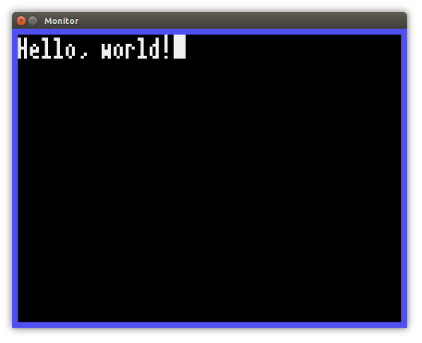
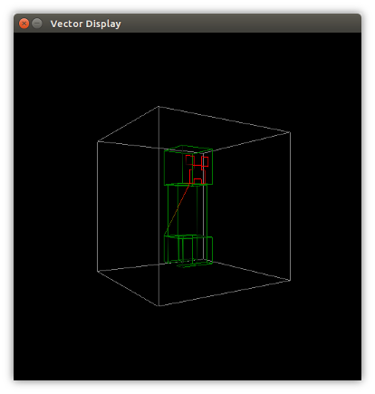

What is Nebula?
===============

 

Nebula is the fast, multi-threaded, full-featured emulator for the DCPU16 computer platform. It runs natively on multiple platforms and supports the full DCPU16 version 1.7 specification and most of the hardware devices.

The source code Nebula is licensed under the terms of the [Apache License Version 2.0](http://www.apache.org/licenses/LICENSE-2.0.html).

Still Confused?
---------------

The [DCPU16](http://en.wikipedia.org/wiki/0x10c) is a computer that exists only as specifications from an ill-fated video game. The DCPU16 is supposed to be similar to computer systems of the past – or simple micro-controllers of the present. It has a processor with some memory, a small instruction set, and a host of standard hardware peripherals including a small monitor, a keyboard, and a clock. Also included is a more fantastical peripheral (after all, it *is* from a video game): a holographic three-dimensional display.

Nebula is a computer program that runs a simulated version of the DCPU16 on your own computer. Nebula can execute arbitrary DCPU16 assembly programs (with the help of the Pulsar series of programs) and interact with the hardware in fun ways. It’s a great learning experience about a bygone era of computing.

Why Nebula?
-----------

Nebula aims to closely follow the DCPU16 specification and to do so with good engineering and design principals. Nebula is easy to use and well-documented.

Using Nebula
============

This section details how to get Nebula up and running.

Installing
----------

The process of installing Nebula is complicated by the necessity that it be compiled from its source code. There’s no reason why Nebula cannot be packaged as something like a RPM or MSI, but doing so is not a priority right now.

The easiest way to get the Nebula sources is to clone the entire Dcpu16Universe (or *dcpu16-universe*, depending on your sensibilities) project with Git.

``` bash
    $ git clone https://github.com/hakuch/Dcpu16Universe dcpu16-universe
```

The Nebula emulator exists in `/src/nebula`, where `/` denotes the root directory of the source tree.

### Source Dependencies and Supported Platforms

Nebula is completely platform independent. It is carefully written to use only platform-neutral features of C++ and makes use of libraries which are themselves cross-platform.

Nebula uses many features from the most recent version of the C++ language standard, C++11. While GCC close to version 4.8 and Clang close to version 3.3 have no issue compiling Nebula, Microsoft’s Visual C++ compiler still struggles with some of the language features. Hopefully this will change in the near future.

Nebula depends on the following libraries and/or platforms, with specific versions where indicated:

-   [Boost](http://www.boost.org/)
-   [SDL2](https://www.libsdl.org/download-2.0.php).
-   [OpenGL Mathematics (GLM)](http://glm.g-truc.net/0.9.5/index.html).
-   [GLEW](http://glew.sourceforge.net/).
-   [OpenGL](http://www.opengl.org/). Nebula requires OpenGL at least version 2.1 and GLSL at least version 1.20.

Nebula requires [CMake](http://www.cmake.org/) to build. Nebula on Unix-y platforms like OS X and any Linux distribution should build without issue if the dependencies are installed.

On Ubuntu 14.04, Nebula’s dependencies can be found in the following packages:

-   `libboost-all-dev`
-   `libsdl2-dev`
-   `libglm-dev`
-   `libglew-dev`
-   `cmake`

Nebula also optionally relies on the following Ubunut 14.04 packages:

-   `ninja-build`
-   `clang`

1.  Create an out-of-source directory for the compiled sources. These out-of-source builds are encouraged by CMake. You may wish to create a `build` directory in `/nebula`.

    Recall that `/` refers to the root directory of the Dcpu16Universe source tree. If your version of Dcpu16Universe lives in `$HOME/src/dcpu16-universe`, then `/` in this document refers to `$HOME/src/dcpu16-universe`.

    ``` bash
        $ mkdir build
    ```

2.  Generate a platform-specific building mechanism. Nebula builds nicely with [Ninja](http://martine.github.io/ninja/), which is a modern alternative to Makefiles. Here, Nebula will be built with the Clang compiler.

    ``` bash
        $ cd build
        $ CC=clang CXX=clang++ cmake -DCMAKE_BUILD_TYPE=Release -G Ninja ..
    ```

3.  Now that the build files have been generated, actually build Ninja.

    ``` bash
        $ ninja
    ```

    One goal of Nebula is that there are no compilation warnings, so please create an issue this is not true for you.

Starting Nebula
---------------

Nebula is launched from a command line shell (such as Bash) since this is the means through which Nebula receives user commands.

### Synopsis

nebula \[*OPTIONS*\] &lt;*MEMORY-FILE*&gt;

### Description

Start up Nebula by loading the file indicated by the path *MEMORY-FILE* into the memory of the DCPU16. Upon being launched, a graphical window will open for the two-dimensional monitor and the holographic vector display.

### Options

`-a`, `--halt-first`  
Rather than starting to execute instructions from the memory of the DCPU16, Nebula will start up with an interactive prompt. From this prompt, it is possible to observe the state of the processor, step through the program in memory, and set break points.

`-d`, `--dump` *DUMP-PATH*  
At the conclusion of program execution – if Nebula is terminated manually, for instance – dump a data image file to disk with the name *DUMP-PATH* containing the state of the DCPU16’s memory at the time of termination.

`-e`, `--little-endian`  
Assume that the image file that is read by Nebula is encoded in the little Endian format. By default, Nebula assumes that data images are encoded as big Endian.

`-h`, `--help`  
Show a short summary of Nebula’s usage and options.

`-p`, `--period` *DURATION*  
Specify the clock period of Nebula in nanoseconds. Nebula tries to be cycle-accurate. This option allows Nebula to simulate different execution speeds. If this option is not provided, then the processor will run at with a 10 us period (a 100 kHz frequency).

For example,

``` bash
    $ nebula -p 1000 a.bin
```

will result in a processor with a clock period of 1 microsecond, which translates to a clock frequency of 1 MHz.

`-v`,`--verbose=` *LOG-PATH*  
Enable logging during execution and output to the file with path *LOG-PATH*. Messages are logged with different levels of severity, and by default only informational messages and those with higher severity are printed. It is possible to change this, but only by editing the source code of Nebula and recompiling it. The ability to change the logging filters at run-time is a planned feature of Nebula.

How Nebula is Designed
======================

Thoughts on Design
------------------

In general, when designing software, I think about a hypothetical outside observer and what they might think of my source code upon viewing it. It is my greatest hope that their first reaction is something along the lines of “this code is *nice*.”

What does “nice” in the context of engineering or programming mean exactly? It means many different things to many different people. To some people, it means lots of different features. To others, high performance.

My definition of nice code is simple: code exhibiting clarity and thoughtfulness.

By *clarity*, I mean that a third-party could navigate around the code with reasonable understanding without the assistance of its original author. No questions like “What the hell does that do?” or even better “*Why* the hell does that work?” should arise.

By *thoughtfulness*, I mean that the underlying abstractions of a design are simple enough to be clear but flexible and powerful enough to allow for further abstractions to be built on them. In other words, a good design acts as a strong foundation for further growth.

*I argue that clear and thoughtful code is easy to add features to and easy to analyze and make high-performing*.

Have I achieved these things with Nebula? Certainly **not**, and I don’t think any person really could. These are instead ideals to strive towards and be mindful of.

Style
-----

Keeping the aforementioned principals in mind, Nebula’s code tends to have the following characteristics:

-   *Verbose logging*. Nebula’s logging is disabled by default, but most everything it does it logged with clear context.

-   *Descriptive identifier names*. Okay, let’s be honest: sometimes Nebula’s code hings on the verbose (but so do I).

-   *Minimization of mutable state*. Lots of mutable state is difficult to reason about. Prefer copying to mutation. Prefer immutable objects.

-   *A functional style*. I can’t help it: I’ve been bitten by the Haskell bug.

-   *Correctness* enforced through type-safety and dimensional analysis.

Architecture and Technology
---------------------------

### Big Idea

One major difference between Nebula and other similar programs is the underlying architecture.

Suppose that a program is emulating a processor (the “CPU”) and two devices: “DevA” and “DevB”. For the sake of example, suppose the devices have the following simulated clock periods:

| Device | Clock Period (second) |
|--------|-----------------------|
| CPU    | 1                     |
| DevA   | 3                     |
| DevB   | 5                     |

A simple emulator might run on a single thread, executing an instruction every iteration and simulating a single clock period.

Every three clock periods, the emulator will switch to DevA and simulate whatever it does. This may include checking if it’s received any interrupts, firing its own interrupts, or reading from and writing to memory.

Similarly, the CPU will switch to DevB every five clock periods.

This is simple, but doesn’t accurately model the reality that these hardware devices are running independently at their own clock speeds. In the simple model, the emulator cannot continue to execute instructions while the keyboard handles the new key code in its buffer, but this is in fact what happens.

In Nebula, the processor, every hardware device, and the main I/O loop all run in their own thread. The processor communicates with hardware devices exclusively through interrupts (yielding control of its state in the process) and all devices share a common bus to memory.

This is slightly harder to get right, but it’s also a lot more fun when it works.

### Little Things

Nebula is written in C++11, and where possible, makes use of several C++11 features such as anonymous functions (“lambdas”), native threads, and atomic variables.

Nebula also makes extensive use of the Boost libraries, particularly the Boost.Option type and some helpers such as Boost.Format.

Nebula prefers to abstract over libraries where possible (OpenGL is a notable exception). It has its own simple API for I/O events and 2D graphics built on top of SDL2.

Nebula is somewhat of an experiment in using dimensional analysis for correctness in programs via Boost.Units. Pixels of the virtual monitor have a distinct unit compared to “real” pixels on your screen. A byte of information has a different unit than a nibble.

Nebula also uses a trick that involves creating type wrappers for primitive types. This can help prevent errors in argument order when a function requires multiple parameters of the same type. For instance, Nebula defines

``` cpp
    struct Blue { explicit Blue(std::uint8_t value) { ... } };
    struct Blue { explicit Blue(std::uint8_t value) { ... } };
    struct Blue { explicit Blue(std::uint8_t value) { ... } };

    struct Color {
        explicit Color(Red red, Green green, Blue blue) { ... }
    };
```

Source Code Organization
------------------------

        ├── cmake             - Files for CMake
        │   └── modules         - Find*.cmake files for dependencies.
        ├── doc               - Out-of-source documentation and manuals.
        ├── src               - Source code.
        │   ├── device          - Virtual hardware devices.
        │   └── platform        - Processor and platform.
        └── src-doc           - Destination for in-source documentation (Doxygen).

Nebula is organized into two main modules:

-   The main platform, which includes the processor and the underlying emulator components.
-   The hardware devices such as the keyboard and monitor.

<!-- For spell-check.
LocalWords:  DCPU Kucharsky natively MSI Dcpu dcpu GCC SDL OpenGL GLM dev cd
LocalWords:  GLEW GLSL CMake libboost libsdl libglm libglew cmake mkdir Haskell
LocalWords:  Makefiles CXX DCMAKE DevA DevB API newtype cpp struct src Doxygen
LocalWords:  LEM multi endian
-->
